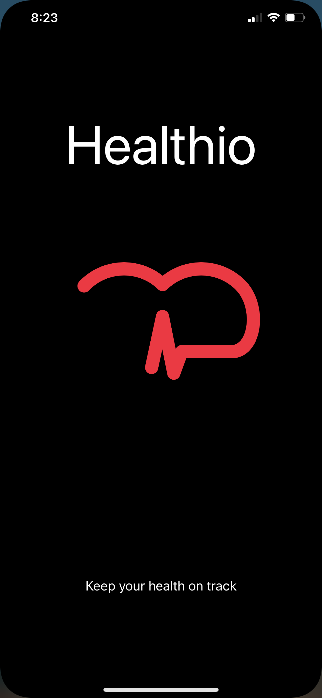
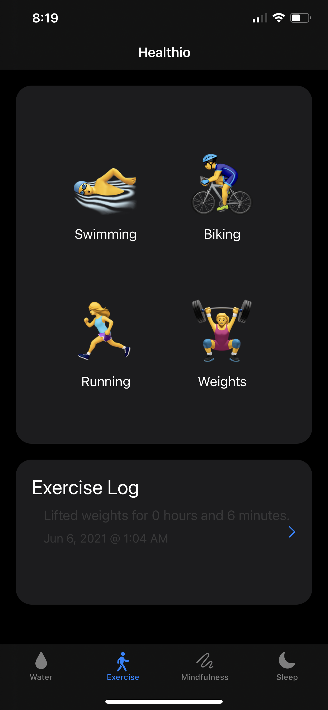
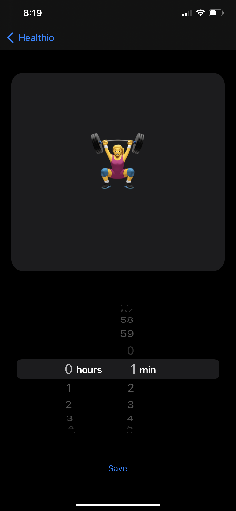
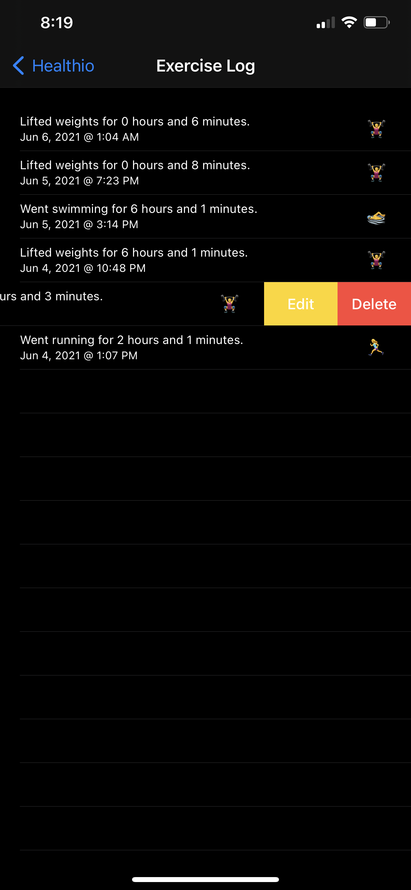
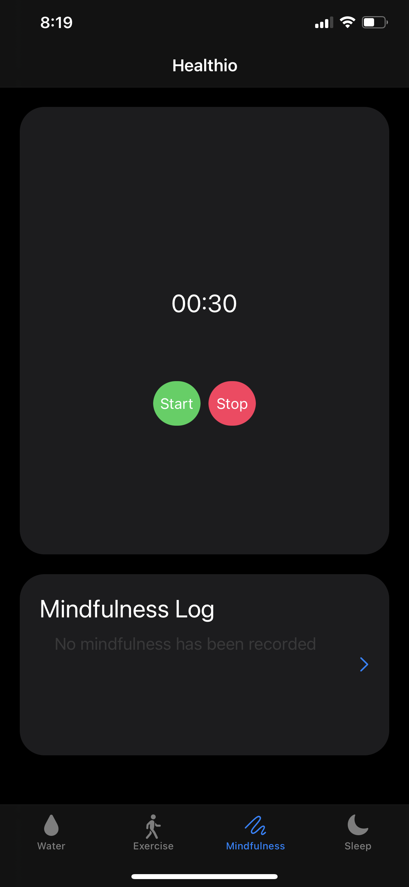
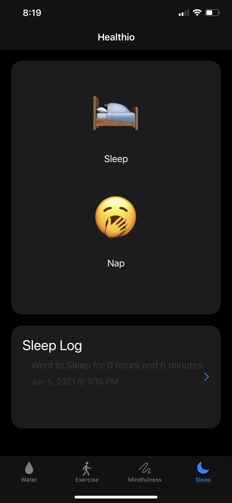

# Healthio
An iOS health tracking app.

## Current Features:
* Input Naps and Sleep, Exercise
* Edit/Delete Nap and Sleep entries, Exercise, & Meditation
* Stores locally
* Animations on startup
* Dark/Light mode support
* Should work on all device sizes (Not always pretty, but it should work)

## Future Features:
- [ ] Animations for tracking water
- [ ] Animations for Meditation
- [ ] Proper landscape support
- [ ] Tracking water with custom vertical slider
- [ ] Settings Page
- [ ] Move code to SwiftUI for more goodies.

